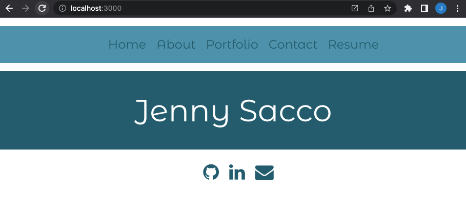
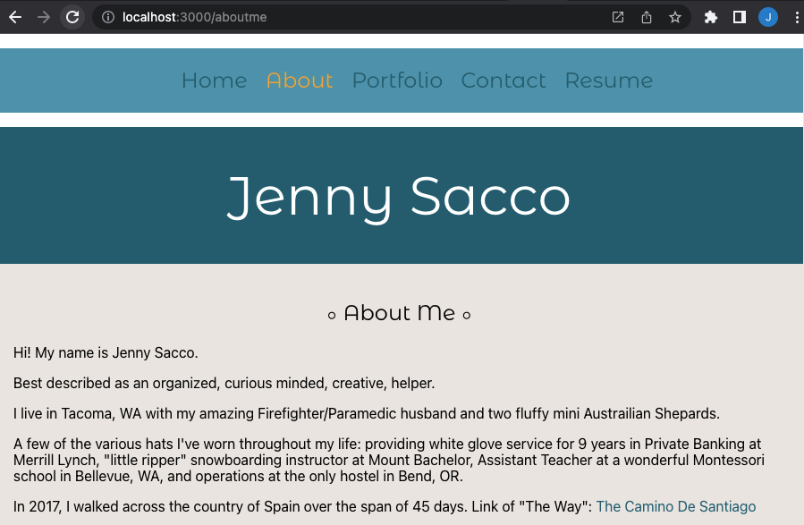
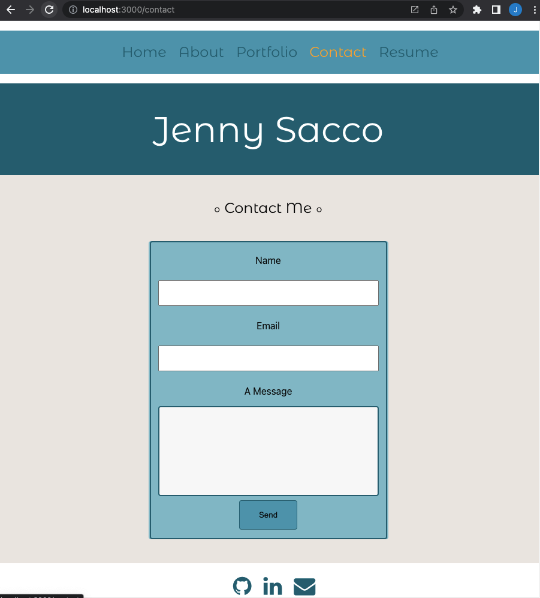

# Portfolio Page 
## <Project Portfolio>

## Table of Contents 

* [Description](#description)

* [LinkToSite](#LinkToSite)

* [Questions](#questions)

## Description

My Portfolio Page is here for you!
 
 
I wanted to make a page that is easy for the user to navigate and where they can quickly get to know me a little better. 
 
 
You can read a bit more about me, navigate through my recent project links, visit my professional LinkedIn profile, read my brief resume, or contact me directly. 
 
 
This is a new addition to my portfolio using React for the first time since the start of my University of Washington Full Stack Web Development class in December 2021.
 
 

 
 

 
 

 
 

## LinkToGithub
https://github.com/jennyrae818/reactPortfolio

## LinkToSite

## LinkToLinkedIn
https://www.linkedin.com/in/jenny-sacco-14024949/ 

## Questions

If you have any questions about the repo, open an issue or contact [Jenny](undefined) directly at jennyrae818@gmail.com.
